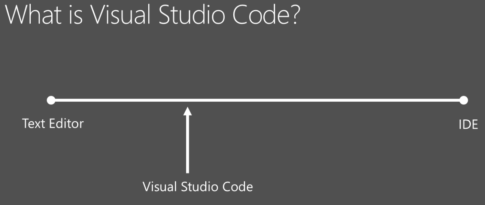
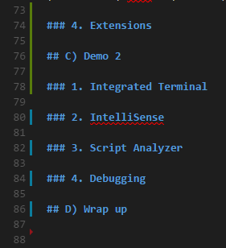

# Talk: Visual Studio Code and PowerShell

Notes and code on GitHub: http://bit.ly/get-psuguk-vscode

- Follow me on Twitter: [Dan1el42](https://twitter.com/Dan1el42)
- Connect with me on LinkedIn: [Daniel Krebs](https://www.linkedin.com/in/krebsdaniel)

## A) Welcome and Introduction

Hello, my name is ...


## B) Demo 1

### 1. What is VS Code?

A code optimized editor with built-in debugging and extension support.

Lightweight code/text editor in between Notepad and full-featured IDEs.

Based on the Electron framework like Atom, Slack but not a fork of Atom.
Actually based on the Visual Studio Online editor (Monaco)



### 2. Where to get it?

- [Stable](https://code.visualstudio.com/download)
- [Insiders](https://code.visualstudio.com/insiders)

### 3. Out of the box experience

#### a. Tour of the UI

1. View Bar
   - Explorer
   - Search/Replace
   - Git
   - Debug
   - Extensions 
1. Side bar
1. Editor Groups
1. Panel
1. Status Bar

**Status Bar**

*Left (Workspace)*

1. Git branch
1. Git Sync
1. Errors and warnings
1. Additional indicators

*Right (Editor)*

1. Line/column
1. Indentation
1. File encoding
1. End of line sequence
1. Language mode
1. Feedback

**Editor Groups / Side-by-side editing**

1. Left
2. Center
3. Right

CMD+\
CMD+1
CMD+2
CMD+3
CMD+Click

Squashing

Most features are not exposed through the menus. They are accessed via the command palette 
or keyboard shortcuts.

#### b. Settings

**Hide files from explorer**

```JSON
    // Configure glob patterns for excluding files and folders.
    "files.exclude": {
        "**/.git": true,
        "**/.svn": true,
        "**/.hg": true,
        "**/.DS_Store": true,
        "**/.vscode": true
    }
```

**Rulers**

```JSON
    // Columns at which to show vertical rulers
    "editor.rulers": [
        100,
        125
    ]
```

**Autosave**

```JSON
    // Controls auto save of dirty files. Accepted values:  "off", "afterDelay", "onFocusChange" (editor loses focus), "onWindowChange" (window loses focus). If set to "afterDelay", you can configure the delay in "files.autoSaveDelay".
    "files.autoSave": "off",

    // Controls the delay in ms after which a dirty file is saved automatically. Only applies when "files.autoSave" is set to "afterDelay"
    "files.autoSaveDelay": 1000
```

**Trim trailing whitespace when you save a file**

```JSON
    // When enabled, will trim trailing whitespace when you save a file.
    "files.trimTrailingWhitespace": true
```

**File extension specific language mode**
```JSON
    "files.associations": {
        "*.myconfig": "json"
    }
```

**Disable tabs**

```JSON
    // Controls if opened editors should show in tabs or not.
    "workbench.editor.showTabs": true
```

Changes take effect immediately.

#### c. Editing and keyboard navigation

**Gutter indicators**



Green bar: Line(s) added
Blue bar: Line(s) modified
Red triangle: Line(s) deleted

**Command Palette**

<kbd>F1</kbd>

`?` Get help
`>` Show and Run commands
`!` 
`#` Search symbols
`edt` 
`ext`
`git`
`task`

**Markdown preview**

<kbd>CMD+K V</kbd>

**Navigate file history**

<kbd>CMD+Tab</kbd>
<kbd>ALT+Left</kbd>
<kbd>ALT+Right</kbd>

**Keyboard bindings**

| Feature | Shortcut (Windows)| Shortcut (Mac) |
| --- | --- | --- |
| Command Palette | <kbd>F1</kbd> or <kbd>Ctrl+Shift+P</kbd> | <kbd>F1</kbd> or <kbd>Cmd+Shift+P</kbd> |
| Quick Open | <kbd>Ctrl+P</kbd>, <kbd>Ctrl+E</kbd> | <kbd>Cmd+P</kbd>, <kbd>Cmd+E</kbd> |
| Toggle side bar | <kbd>Ctrl+B</kbd> | <kbd>Cmd+B</kbd> |
| Switch to Explorer | <kbd>Ctrl+Shift+E</kbd> | <kbd>Cmd+Shift+E</kbd> |
| Switch to Global Search  | <kbd>Ctrl+Shift+F</kbd> | <kbd>Cmd+Shift+F</kbd> |
| Switch to Global Replace | <kbd>Ctrl+Shift+H</kbd> | <kbd>Cmd+Shift+H</kbd> |
| Switch to Git | <kbd>Ctrl+Shift+G</kbd> | <kbd>Cmd+Shift+G</kbd> |
| Switch to Debug  | <kbd>Ctrl+Shift+D</kbd> | <kbd>Cmd+Shift+D</kbd> |
| Switch to Extensions | <kbd>Ctrl+Shift+X</kbd> | <kbd>Cmd+Shift+X</kbd> |
| Error and warnings | <kbd>Ctrl+Shift+M</kbd> | <kbd>Cmd+Shift+M</kbd> |
| - Cycle forward | <kbd>F8</kbd> | <kbd>F8</kbd> |
| - Cycle backwards | <kbd>Shift+F8</kbd> | <kbd>Shift+F8</kbd> |
| Change language mode (syntax highlighting) | <kbd>Ctrl+K M</kbd> | <kbd>Cmd+K M</kbd> |
| Change themes | <kbd>F1 color theme</kbd> | <kbd>F1 color theme</kbd> |
| Close current folder | <kbd>Ctrl+K F</kbd> | <kbd>Cmd+K F</kbd> |
| Jump to line | <kbd>Ctrl+G</kbd> or <kbd>Ctrl+P :<kbd> | <kbd>Cmd+G</kbd> or <kbd>Cmd+P :<kbd> |
| Select current line | <kbd>Ctrl+I</kbd> | <kbd>Cmd+I</kbd> |
| Zoom In | Ctrl+= | Cmd+= |
| Zoom Out | Ctrl+- | Cmd+- |
| Trigger IntelliSense | <kbd>Ctrl+Space</kbd> | <kbd>Cmd+Space</kbd> |
| Goto definition | <kbd>F12</kbd> | <kbd>F12</kbd> |
| Peek definition | <kbd>Alt+F12</kbd> | <kbd>Opt+F12</kbd> |
| Open definition to the side | <kbd>Ctrl+Alt+Click</kbd> | <kbd>Cmd+Opt+Click</kbd> |
| Find all references | <kbd>Shift+F12</kbd> | <kbd>Shift+F12</kbd> |
| Change all occurrences | <kbd>Ctrl+F2</kbd> | <kbd>Cmd+F2</kbd> |
| Bracket matching | <kbd>Ctrl+Shift+\</kbd> |<kbd>Cmd+Shift+\</kbd> |
| Move Lines Up | <kbd>Alt+Up</kbd> | <kbd>Opt+Up</kbd> | 
| Move Lines Down | <kbd>Alt+Down</kbd> | <kbd>Opt+Down</kbd> |
| Copy current line (up) | <kbd>Shift+Alt+Up</kbd> | <kbd>Shift+Opt+Up</kbd> |
| Copy current line (down) | <kbd>Shift+Alt+Down</kbd> | <kbd>Shift+Opt+Down</kbd> |
| Find by symbol | <kbd>Ctrl+Shift+O</kbd> | <kbd>Cmd+Shift+O</kbd> |
| Add cursors above | <kbd>Ctrl+Shift+Alt+Up</kbd> | <kbd>Cmd+Shift+Opt+Up</kbd> |
| Add cursors below | <kbd>Ctrl+Shift+Alt+Down</kbd> | <kbd>Cmd+Shift+Opt+Down</kbd> |
| Add cursors to the right | <kbd>Ctrl+Shift+Alt+Right</kbd> | <kbd>Cmd+Shift+Opt+Right</kbd> |
| Add cursors to the left | <kbd>Ctrl+Shift+Alt+Left</kbd> | <kbd>Cmd+Shift+Opt+Left</kbd> |
| Select current word | <kbd>Ctrl+D</kbd> | <kbd>Cmd+D</kbd> |
| Expand selection | <kbd>Shift+Alt+Right</kbd> | <kbd>Shift+Opt+Right</kbd> |
| Shrink selection | <kbd>Shift+Alt+Left</kbd> | <kbd>Shift+Opt+Left</kbd> |
| Format code | <kbd>Shift+Alt+F</kbd> | <kbd>Shift+Opt+F</kbd> |
| Scroll file (Up) | <kbd>Ctrl+Up</kbd> | <kbd>Ctrl+Up</kbd> |
| Toggle Terminal | <kbd>Ctrl+'</kbd> | <kbd>Cmd+'</kbd> |
| Code folding | <kbd>Ctrl+Shift+[ | |
| Code folding | <kbd>Ctrl+Shift+] | |
| Undo cursor position | <kbd>Ctrl+U | <kbd>Cmd+U</kbd> |
| Trim trailing whitespace | <kbd>Ctrl+K Ctrl+X | <kbd>Cmd+K Cmd+X</kbd> |
| Copy path of active file | <kbd>Ctrl+K P | <kbd>Cmd+K P</kbd> |
| Show active file in File Explorer / Finder | <kbd>Ctrl+K R | <kbd>Cmd+K R |
| Comment/Uncomment line | <kbd>Ctrl+/ | Cmd+/ |

Define with <kbd>Ctrl+K Ctrl+K</kbd>

#### d. Git integration

**Branches and Tags**

**Inline view vs. changes view**

**Stage / Unstage**

**Commit / Multi-line commit**

**Publish**

#### Default diff / merge tool

**Command line arguments**

`-d` or `--diff`
`-n` or `--new-window`
`-r` or `--reuse-window`
`-g` or `--goto`
`file`
`file:line:column?`

#### e. Snippets / JSON schema


### 4. Extensions

1. [PowerShell](https://marketplace.visualstudio.com/items?itemName=ms-vscode.PowerShell)
1. [Open in GitHub / Bitbucket / VisualStudio.com](https://marketplace.visualstudio.com/items?itemName=ziyasal.vscode-open-in-github)
1. [Bookmarks](https://marketplace.visualstudio.com/items?itemName=alefragnani.Bookmarks)
1. Spelling and Grammar Checker
1. [Git History (including git log)](https://marketplace.visualstudio.com/items?itemName=donjayamanne.githistory)
1. [Git Blame](https://marketplace.visualstudio.com/items?itemName=waderyan.gitblame)
1. [Annotator](https://marketplace.visualstudio.com/items?itemName=ryu1kn.annotator)
1. [Align](https://marketplace.visualstudio.com/items?itemName=steve8708.Align)
1. [Beautify](https://marketplace.visualstudio.com/items?itemName=HookyQR.beautify)
1. [EditorConfig](https://marketplace.visualstudio.com/items?itemName=EditorConfig.EditorConfig) - [How it works?](http://editorconfig.org/)
1. [Runner](https://marketplace.visualstudio.com/items?itemName=mattn.Runner)
1. [Code Runner](https://marketplace.visualstudio.com/items?itemName=formulahendry.code-runner)
1. [Slack](https://marketplace.visualstudio.com/items?itemName=sozercan.slack)
1. [Project Manager](https://marketplace.visualstudio.com/items?itemName=alefragnani.project-manager) 

#### Side-loading

`~\.vscode\extensions`

## C) Demo 2

### 1. Integrated Terminal

New/Toggle <kbd>Ctrl/Cmd+'</kbd>

### 2. IntelliSense

<kbd>Ctrl/Cmd+Space</kbd>

### 3. Script Analyzer

### 4. Debugging

* Breakpoints <kbd>F9</kbd>
* Conditional breakpoints

### 5. Run tasks

## D) Wrap up
